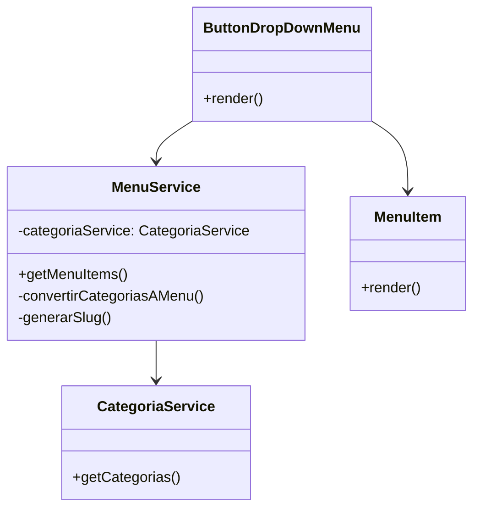
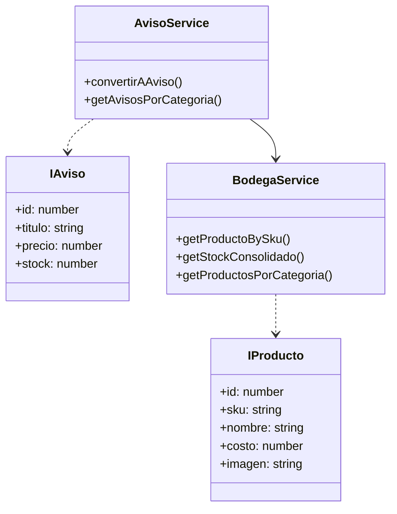

# Proyecto Tienda Deccos - Actividades de Patrones de Diseño

## Actividad 1: Implementación de Autenticación con Next-Auth

### Requisitos Implementados

1. **Sistema de Autenticación**

   - Implementación de Next-Auth para manejo de sesiones
   - Integración con base de datos PostgreSQL
   - Modelo de Cliente para almacenar usuarios

2. **Funcionalidades**

   - Registro de usuarios
   - Login/Logout
   - Manejo de sesiones
   - Protección de rutas

3. **Componentes Desarrollados**

   - Formulario de registro
   - Formulario de login
   - Componente de sesión en header
   - Middleware para protección de rutas

4. **Base de Datos**
   - Tabla de Clientes
   - Integración con Prisma ORM
   - Manejo seguro de contraseñas con bcrypt

### Diagrama de la Implementación

```
├── app/
│   ├── api/
│   │   └── auth/
│   │       └── [...nextauth]/
│   └── auth/
│       ├── login/
│       └── register/
├── components/
│   ├── auth/
│   │   ├── LoginForm.tsx
│   │   └── RegisterForm.tsx
└── lib/
    └── auth.ts
```

## Actividad 1: Implementación de Menú Jerárquico de Categorías

### Requisitos Implementados

1. **Estructura de Datos**

   - Modelo de categorías con relación padre-hijo
   - Interface `ICategoria` y `ItemMenu`
   - Tabla Categoria con auto-referencia

2. **Servicios Implementados**

   - **MenuService** (`/services/categories/menu.service.ts`):
     - `getMenuItems()`: Obtiene estructura jerárquica del menú
     - `convertirCategoriasAMenu()`: Convierte categorías en items de menú
     - `generarSlug()`: Genera URLs amigables
   - **CategoriaService** (`/services/categories/category.service.ts`):
     - `getCategorias()`: Obtiene todas las categorías

3. **Componentes UI**

   - `ButtonDropDownMenu`: Menú desplegable principal
   - `MenuItems`: Renderiza lista de items
   - `MenuItem`: Renderiza item individual o submenú

4. **Estructura de Datos**

```typescript
interface ICategoria {
  id: number;
  nombre: string;
  padre_id: number | null;
}

interface ItemMenu {
  texto: string;
  enlace: string;
  slug: string;
  hijos?: ItemMenu[];
}
```

### Ejemplo de Jerarquía

```
Categorías Principales:
├── Lámparas
│   ├── Salón
│   ├── Comedor
│   ├── Dormitorio
│   └── Exterior
└── Sillas
    ├── Clásicas
    ├── Modernas
    └── Rústicas
```

### Diagrama de Clases



### Beneficios de la Implementación

1. **Organización Clara**:

   - Separación entre datos y presentación
   - Servicios especializados
   - Componentes reutilizables

2. **Mantenibilidad**:
   - Fácil agregar nuevas categorías
   - Estructura flexible para subcategorías
   - URLs amigables automáticas

## Actividad 2: Implementación del Patrón de Servicios

### Requisitos Implementados

1. **Interfaces Definidas** (`/types/products/`)

   - `IProducto`: Estructura base de productos
   - `IStock`: Manejo de inventario
   - `IAviso`: Presentación de productos

2. **Servicios** (`/services/categories/`)

   - **BodegaService**:
     - Gestión de productos y stock
     - Métodos: getProductoBySku, getStockConsolidado, getProductosPorCategoria
   - **AvisoService**:
     - Transformación de productos a avisos
     - Cálculo automático de precio con 30% de utilidad

3. **Repositorios** (`/repositories/`)

   - **ProductoRepository**: Acceso a datos de productos
   - **StockRepository**: Gestión de inventario

4. **Base de Datos**
   - Tablas: Producto, Stock, Categoria, Bodega
   - Relaciones establecidas
   - Datos de prueba insertados

### Diagrama de Clases



### Estructura del Proyecto

```
services/
  ├── categories/
  │   ├── aviso.service.ts
  │   ├── bodega.service.ts
  │   ├── menu.service.ts
  │   └── category.service.ts
repositories/
  ├── product.repository.ts
  └── stock.repository.ts
types/
  ├── products/
  │   ├── product-types.ts
  │   └── stock-types.ts
  ├── menu/
  │   └── item-menu.types.ts
  └── category/
      └── category.ts
```

### Beneficios de la Implementación

1. **Separación de Responsabilidades**

   - Servicios manejan lógica de negocio
   - Repositorios manejan acceso a datos
   - Interfaces definen contratos claros

2. **Mantenibilidad**

   - Código organizado por funcionalidad
   - Fácil de modificar y extender
   - Bajo acoplamiento entre componentes

3. **Escalabilidad**
   - Fácil agregar nuevos servicios
   - Fácil modificar lógica de negocio
   - Independencia de la fuente de datos

## Tecnologías Utilizadas

- Next.js 14
- TypeScript
- PostgreSQL con Prisma
- Tailwind CSS
- Next-Auth
- Bcrypt

## Instalación y Uso

```bash
npm install
npm run dev
```

## Configuración de Base de Datos

```bash
# Configurar variables de entorno
DATABASE_URL="postgresql://..."
NEXTAUTH_SECRET="..."
NEXTAUTH_URL="http://localhost:3000"

# Ejecutar migraciones
npx prisma migrate dev
```

# Implementación del Patrón de Servicios - Tienda Deccos

## Descripción del Patrón

El patrón de servicios implementado en este proyecto sigue el principio de Separación de Responsabilidades (SRP) y se estructura en tres capas principales:

### 1. Capa de Servicios

Los servicios actúan como intermediarios entre la capa de presentación y los repositorios. Cada servicio tiene una responsabilidad única:

- **BodegaService**:

  - Responsabilidad: Gestionar la lógica de negocio relacionada con productos y stock
  - Beneficio: Centraliza todas las operaciones relacionadas con el inventario
  - Ejemplo: Cuando se necesita el stock de un producto, este servicio consolida la información de todas las bodegas

- **AvisoService**:
  - Responsabilidad: Transformar productos en avisos para su presentación
  - Beneficio: Encapsula la lógica de presentación y cálculo de precios
  - Ejemplo: Aplica el 30% de utilidad al costo del producto automáticamente

### 2. Capa de Repositorios

Los repositorios manejan el acceso a datos:

- **ProductoRepository**:

  - Responsabilidad: CRUD de productos
  - Beneficio: Abstrae la complejidad de las consultas a la base de datos

- **StockRepository**:
  - Responsabilidad: Gestión del stock
  - Beneficio: Centraliza las operaciones de inventario

### 3. Capa de Interfaces

Define los contratos que deben seguir las entidades:

- **IProducto**: Define la estructura de un producto
- **IStock**: Define la estructura del stock
- **IAviso**: Define cómo se presenta un producto en la tienda

## Beneficios de la Implementación

1. **Mantenibilidad**:

   - Cada componente tiene una responsabilidad única
   - Los cambios en la lógica de negocio solo afectan a los servicios
   - Los cambios en el acceso a datos solo afectan a los repositorios

2. **Escalabilidad**:

   - Fácil agregar nuevos servicios sin afectar los existentes
   - Posibilidad de cambiar la base de datos sin afectar la lógica de negocio

3. **Testabilidad**:
   - Cada capa puede ser probada de forma independiente
   - Facilita la creación de mocks para pruebas

## Ejemplo de Flujo

```typescript
// 1. El frontend solicita productos de una categoría
const avisos = await avisoService.getAvisosPorCategoria(1);

// 2. AvisoService solicita productos a BodegaService
const productos = await bodegaService.getProductosPorCategoria(1);

// 3. BodegaService usa ProductoRepository para obtener datos
const productos = await productoRepository.findByCategoriaId(1);

// 4. Para cada producto, se obtiene su stock
const stock = await stockRepository.getStockConsolidado(productoId);

// 5. Se transforma el producto en aviso
const aviso = {
  ...producto,
  precio: producto.costo * 1.3,
  stock,
};
```

## Tecnologías Utilizadas

- Next.js 14
- TypeScript
- PostgreSQL con Prisma
- Tailwind CSS

This is a [Next.js](https://nextjs.org/) project bootstrapped with [`create-next-app`](https://github.com/vercel/next.js/tree/canary/packages/create-next-app).

## Getting Started

First, run the development server:

```bash
npm run dev
# or
yarn dev
# or
pnpm dev
# or
bun dev
```

Open [http://localhost:3000](http://localhost:3000) with your browser to see the result.

You can start editing the page by modifying `app/page.tsx`. The page auto-updates as you edit the file.

This project uses [`next/font`](https://nextjs.org/docs/basic-features/font-optimization) to automatically optimize and load Inter, a custom Google Font.

## Learn More

To learn more about Next.js, take a look at the following resources:

- [Next.js Documentation](https://nextjs.org/docs) - learn about Next.js features and API.
- [Learn Next.js](https://nextjs.org/learn) - an interactive Next.js tutorial.

You can check out [the Next.js GitHub repository](https://github.com/vercel/next.js/) - your feedback and contributions are welcome!

## Deploy on Vercel

The easiest way to deploy your Next.js app is to use the [Vercel Platform](https://vercel.com/new?utm_medium=default-template&filter=next.js&utm_source=create-next-app&utm_campaign=create-next-app-readme) from the creators of Next.js.

Check out our [Next.js deployment documentation](https://nextjs.org/docs/deployment) for more details.
