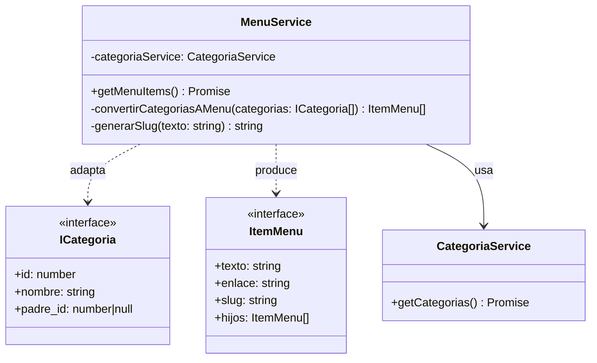
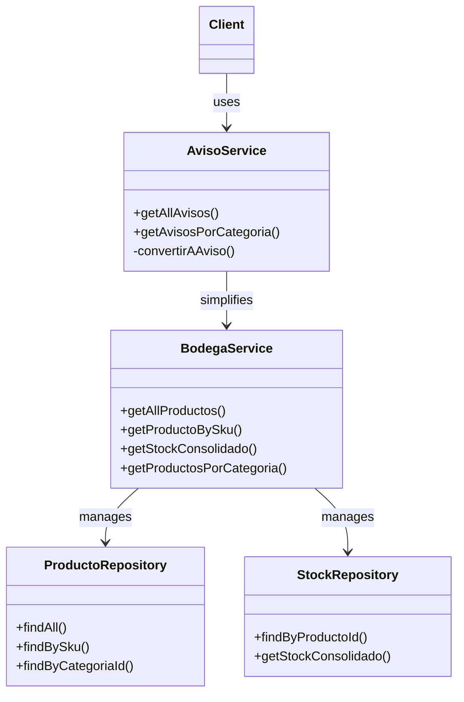
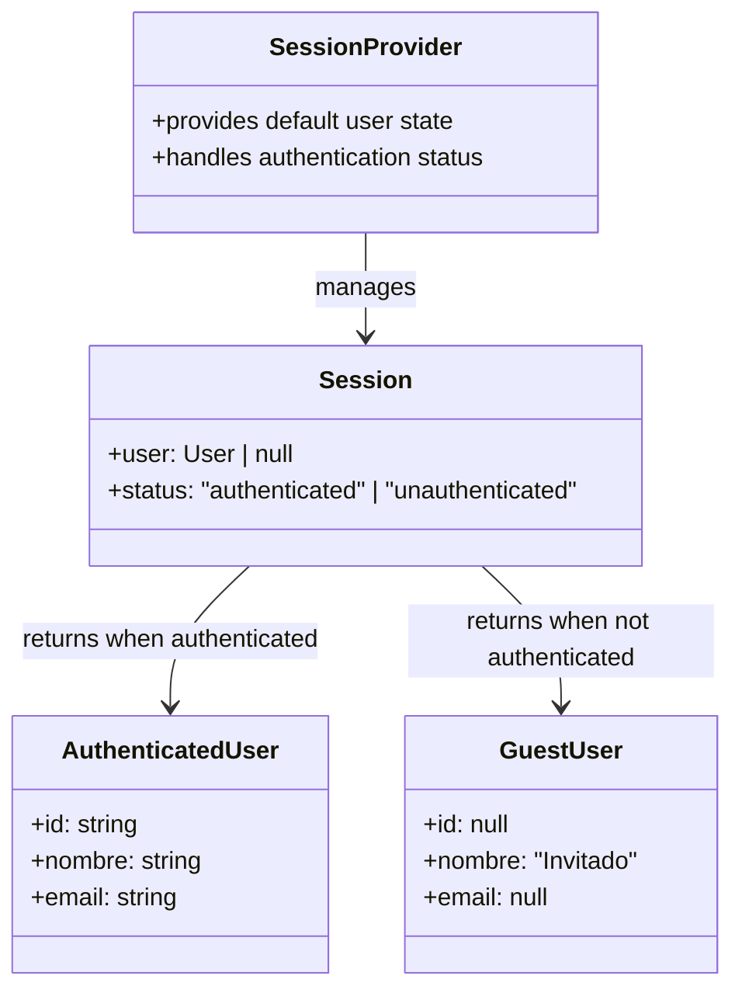

# Proyecto Tienda Deccos - Patrones de Diseño

## Estructura del Proyecto

```
├── app/                  # Páginas y rutas de Next.js
├── components/           # Componentes React reutilizables
├── infrastructure/       # Capa de infraestructura
│   ├── repositories/     # Repositorios para acceso a datos
│   └── services/         # Servicios de la aplicación
├── types/                # Interfaces y tipos TypeScript
└── prisma/               # Schema y migraciones de base de datos
```

## Actividad 1: Menú Jerárquico de Categorías

### Patrón de Diseño: Adaptador (Adapter)

##### Problema

Se necesita convertir la estructura plana de categorías (`ICategoria[]`) en una estructura jerárquica de menú (`ItemMenu[]`) que sea adecuada para la navegación en la interfaz de usuario. Las interfaces `ICategoria` e `ItemMenu` son incompatibles en su estructura.

##### Solución

Se implementó el patrón Adaptador a través del `MenuService`, que actúa como un adaptador entre la estructura de datos de categorías y la estructura requerida para el menú de navegación.

```typescript
interface ICategoria {
  id: number;
  nombre: string;
  padre_id: number | null;
}

interface ItemMenu {
  texto: string;
  enlace: string;
  slug: string;
  hijos: ItemMenu[];
}

// Adaptador
class MenuService {
  private categoriaService: CategoriaService;

  async getMenuItems(): Promise<ItemMenu[]> {
    const categorias = await this.categoriaService.getCategorias();
    return this.convertirCategoriasAMenu(categorias);
  }

  private convertirCategoriasAMenu(categorias: ICategoria[]): ItemMenu[] {
    const categoriasMap = new Map<number, ItemMenu>();
    const menuItems: ItemMenu[] = [];

    categorias.forEach((categoria) => {
      const menuItem: ItemMenu = {
        texto: categoria.nombre,
        enlace: `/categoria/${categoria.id}/${this.generarSlug(categoria.nombre)}`,
        slug: this.generarSlug(categoria.nombre),
        hijos: [],
      };
      categoriasMap.set(categoria.id, menuItem);

      if (!categoria.padre_id) {
        menuItems.push(menuItem);
      }
    });

    categorias.forEach((categoria) => {
      if (categoria.padre_id) {
        const padre = categoriasMap.get(categoria.padre_id);
        const hijo = categoriasMap.get(categoria.id);
        if (padre && hijo) {
          padre.hijos.push(hijo);
        }
      }
    });

    return menuItems;
  }
}
```

##### Beneficios

1. **Separación de Responsabilidades**:

El `MenuService` encapsula toda la lógica de conversión, manteniendo el código limpio y organizado.

2. **Reutilización**:

La transformación puede ser utilizada en cualquier parte de la aplicación que necesite convertir categorías a elementos de menú.

3. **Mantenibilidad**:

Los cambios en la estructura de las categorías o del menú solo requieren modificaciones en el adaptador.

4. **Flexibilidad**:

Permite trabajar con interfaces incompatibles sin modificar su código fuente.

##### Diagrama de Clases



## Actividad 2: Gestión de Productos y Stock

### Patrón de Diseño: Fachada (Facade)

Se eligió el patrón Fachada porque:

1. **Problema**:

   - Sistema complejo con múltiples subsistemas (productos, stock, avisos)
   - Necesidad de una interfaz simplificada para el cliente
   - Múltiples operaciones relacionadas que debían coordinarse

2. **Solución**:

   - `AvisoService` actúa como fachada, simplificando la interacción con los subsistemas
   - Encapsula la complejidad de la lógica de negocio
   - Coordina las operaciones entre `BodegaService`, `ProductoRepository` y `StockRepository`

3. **Beneficios**:

   - Interfaz unificada y simple para el cliente
   - Desacoplamiento entre la presentación y la lógica de negocio
   - Centralización de la lógica de transformación de productos a avisos

### Implementación

```typescript
class AvisoService {
  constructor(private bodegaService: BodegaService) {}

  async getAllAvisos(): Promise<IAviso[]> {
    const productos = await this.bodegaService.getAllProductos();
    return Promise.all(productos.map((producto) => this.convertirAAviso(producto)));
  }

  async getAvisosPorCategoria(categoriaId: number): Promise<IAviso[]> {
    const productos = await this.bodegaService.getProductosPorCategoria(categoriaId);
    return Promise.all(productos.map((producto) => this.convertirAAviso(producto)));
  }

  private async convertirAAviso(producto: IProducto): Promise<IAviso> {
    
    const stock = await this.bodegaService.getStockConsolidado(producto.id);
    return {
      id: producto.id,
      nombre: producto.nombre,
      precio: producto.costo * 1.3, 
      stock: stock,
      sku: producto.sku,
    };
  }
}
```

### Diagrama de la Fachada



## Actividad 3: Manejo de Usuarios No Autenticados

### Patrón de Diseño: Null Object

#### Problema

Se necesita manejar de forma segura los estados de autenticación sin generar errores de NullPointerException, manteniendo una experiencia de usuario fluida.

#### Solución con NextAuth

NextAuth proporciona una solución más elegante y moderna que las tradicionales de Java:

1. **Manejo Automático de Estados**:

```typescript
const { data: session } = useSession();
const userName = session?.user?.nombre || 'Invitado';
```

2. **Tipos Seguros**:

```typescript
interface Session {
  user: {
    id: string;
    nombre: string;
    email: string;
    comuna: string;
    direccion: string;
  } | null;
}
```

#### Ventajas sobre Spring Security

1. **Simplicidad**:

   - No requiere configuración compleja de XML o Java
   - Integración nativa con React y TypeScript
   - Manejo automático de sesiones

2. **Seguridad Mejorada**:

   - Prevención nativa de NullPointerException
   - Manejo automático de tokens JWT
   - Protección contra CSRF integrada

3. **Desarrollo más Rápido**:

   - Menos código boilerplate
   - Configuración declarativa
   - Hot-reloading de cambios

4. **Mejor Experiencia de Usuario**:
   - Transiciones suaves entre estados
   - No requiere recargas de página
   - Estado de autenticación persistente

#### Comparación con Spring Security

| Característica | NextAuth            | Spring Security        |
| -------------- | ------------------- | ---------------------- |
| Configuración  | Declarativa, simple | XML/Java, compleja     |
| Manejo de Null | Automático          | Requiere configuración |
| Integración    | Nativa con React    | Requiere adaptadores   |
| Desarrollo     | Rápido              | Más lento              |
| Mantenimiento  | Simple              | Complejo               |

#### Ejemplo de Implementación

```typescript
export default function UserProfile() {
  const { data: session } = useSession();

  return (
    <div>
      <h1>Bienvenido {session?.user?.nombre || 'Invitado'}</h1>
      {session ? (
        <UserDashboard user={session.user} />
      ) : (
        <GuestView />
      )}
    </div>
  );
}
```

#### Beneficios

1. **Código más Limpio**:

   - No hay necesidad de manejar excepciones
   - Tipado seguro con TypeScript
   - Menos código boilerplate

2. **Mejor Mantenibilidad**:

   - Separación clara de responsabilidades
   - Fácil de extender
   - Documentación clara

3. **Rendimiento**:

   - Carga más rápida
   - Menos overhead
   - Mejor caching

4. **Seguridad**:
   - Protección automática contra ataques comunes
   - Manejo seguro de sesiones
   - Tokens JWT seguros

#### Diagrama de la Solución



## Tecnologías y Configuración

### Stack Tecnológico

- Next.js 14
- TypeScript
- PostgreSQL con Prisma
- Next-Auth
- Tailwind CSS

### Variables de Entorno

```bash
DATABASE_URL="postgresql://..."
NEXTAUTH_SECRET="..."
NEXTAUTH_URL="http://localhost:3000"
```

### Comandos

```bash
# Instalación
npm install    # Instalar dependencias
npm run dev    # Iniciar servidor de desarrollo

# Base de Datos
npx prisma db push  # Sincronizar el schema con la base de datos
npx prisma generate # Generar el cliente de Prisma

# Datos de Prueba
# 1. Ubicar el archivo SQL en la raíz del proyecto:
#    /tienda/database/seed.sql

# 2. Ejecutar el archivo SQL en tu base de datos:
#    - Si usas el cliente psql:
psql -h tu-host -d tu-database -U tu-usuario -f database/seed.sql

#    - Si usas pgAdmin:
#    1. Abrir pgAdmin
#    2. Conectar a tu base de datos
#    3. Abrir la herramienta de consultas
#    4. Arrastrar o copiar el contenido de seed.sql
#    5. Ejecutar las consultas

# El archivo seed.sql contiene:
# - Datos de categorías con estructura jerárquica
# - Productos de ejemplo
# - Registros de stock
# - Usuarios de prueba
```
